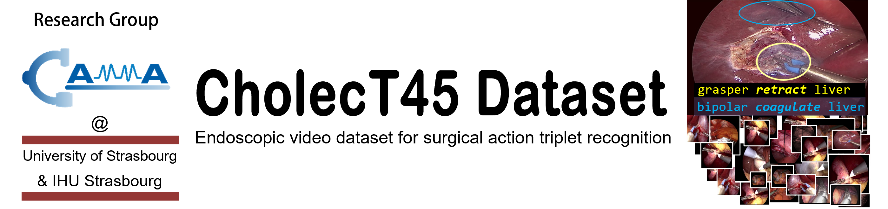

<div align="center">
<a href="http://camma.u-strasbg.fr/">

</a>
</div>
<br/>

<!-- # CholecT45 
------------------------------------------------
An endoscopic video dataset for surgical action triplet recognition.
-->

------------------------------------------------


[](https://hamzamohdzubair.github.io/redant/)


This folder includes: 
- CholecT45 dataset:
  - **data**: 45 cholecystectomy videos
  - **triplet**: triplet annotations on 45 videos
  - **instrument**: tool annotations on 45 videos
  - **verb**: action annotations on 45 videos
  - **target**: target annotations on 45 videos
  - **dict**: id-to-name mapping files
  - a LICENCE file
  - a README file


<details>
  <summary>  
  Expand this to visualize the dataset directory structure.
  </summary>
  
  ```
    ──CholecT45
        ├───data
        │   ├───VID01
        │   │   ├───000000.png
        │   │   ├───000001.png
        │   │   ├───000002.png
        │   │   ├───
        │   │   └───N.png
        │   ├───VID02
        │   │   ├───000000.png
        │   │   ├───000001.png
        │   │   ├───000002.png
        │   │   ├───
        │   │   └───N.png
        │   ├───
        │   ├───
        │   ├───
        │   |
        │   └───VIDN
        │       ├───000000.png
        │       ├───000001.png
        │       ├───000002.png
        │       ├───
        │       └───N.png
        |
        ├───triplet
        │   ├───VID01.txt
        │   ├───VID02.txt
        │   ├───
        │   └───VIDNN.txt
        |
        ├───instrument
        │   ├───VID01.txt
        │   ├───VID02.txt
        │   ├───
        │   └───VIDNN.txt
        |
        ├───verb
        │   ├───VID01.txt
        │   ├───VID02.txt
        │   ├───
        │   └───VIDNN.txt
        |
        ├───target
        │   ├───VID01.txt
        │   ├───VID02.txt
        │   ├───
        │   └───VIDNN.txt
        |
        ├───dict
        │   ├───triplet.txt
        │   ├───instrument.txt
        │   ├───verb.txt
        │   ├───target.txt
        │   └───maps.txt
        |
        ├───LICENSE
        └───README.md
   ```
</details>

<br>

------------------------------------------------
## Download Dataset

The CholecT45 dataset has been officially released for public use on April 12, 2022. If you wish to have access to this dataset, please kindly fill the request [form](https://forms.gle/jTdPJnZCmSe2Daw7A).

<br><br>

------------------------------------------------
DATASET DESCRIPTION
================================================

The CholecT45 dataset contains 45 videos of cholecystectomy procedures collected in Strasbourg, France. It is a subset of Cholec80 [1] dataset.
CholecT45 is an extension of CholecT40 [2] with additional videos and standardized annotations.
The images are extracted at 1 fps from the videos and annotated with triplet information about surgical actions in the format of <instrument, verb, target>. 
In total, there are 90489 frames and 127385 triplet instances in the dataset.
To ensure anonymity, frames corresponding to out-of-body views are entirely blacked (RGB 0 0 0) out.


------------------------------------------------
Triplet Annotations
================================================

Each triplet annotation file contains a table, consisting of 101 columns. 
Every row contains an annotation for an image in the video. 
The first column indicates the frame index of the annotated image in the video. The frame index is defined under a 0-based system. 
The other 100 columns are the binary labels for the triplets (0=not present; 1=present).
This last 100 columns sequentially correspond to the triplets IDs (0..99) and names as contained in the mapping file (dict/triplet.txt)

For simplicity, we also provide annotations for the various components of the triplets: instrument, verb and target.

------------------------------------------------
Instrument Annotations
================================================

Each instrument annotation file contains a table, consisting of 7 columns. 
Every row contains an annotation for an image in the video. 
The first column indicates the frame index of the annotated image in the video. The frame index is defined under a 0-based system. 
The other 6 columns are the binary labels for the instrument (0=not present; 1=present).
This last 6 columns sequentially correspond to the instrument IDs (0..5) and names as contained in the mapping file (dict/instrument.txt)


------------------------------------------------
Verb Annotations
================================================

Each verb annotation file contains a table, consisting of 11 columns. 
Every row contains an annotation for an image in the video. 
The first column indicates the frame index of the annotated image in the video. The frame index is defined under a 0-based system. 
The other 10 columns are the binary labels for the verb (0=not present; 1=present).
This last 10 columns sequentially correspond to the verb IDs (0..9) and names as contained in the mapping file (dict/verb.txt)


------------------------------------------------
Target Annotations
================================================

Each target annotation file contains a table, consisting of 16 columns. 
Every row contains an annotation for an image in the video. 
The first column indicates the frame index of the annotated image in the video. The frame index is defined under a 0-based system. 
The other 15 columns are the binary labels for the target (0=not present; 1=present).
This last 15 columns sequentially correspond to the target IDs (0..14) and names as contained in the mapping file (dict/target.txt)


------------------------------------------------
Dict
================================================

The dict folder contains mapping of the label ID to full name for various tasks viz-a-viz: triplet, instrument, verb, and target. 
Specifically, the maps.txt file contains a table, consisting of 6 columns for mapping triplet IDs to their component IDs.
This is useful for decomposing a triplet to its constituting components.
The first column indicates the triplet ID (that is instrument-verb-target paring IDs).
The second column indicates the instrument ID.
The third column indicates the verb IDs.
The fourth column indicates the target IDs.
The fifth column indicates the instrument-verb pairing IDs.
The sixth column indicates the instrument-target pairing IDs.

Example usage: 
The first row in the maps.txt shows:
1,0,2,0,2,0
This means that triplet iD 1 can be mapped to <0, 2, 0> which is {grasper, dissect, gallbladder}.


------------------------------------------------
License and References
================================================

This dataset could only be generated thanks to the continuous support from our surgical partners. In order to properly credit the authors and clinicians for their efforts, you are kindly requested to cite the work that led to the generation of this dataset:
- C.I. Nwoye, T. Yu, C. Gonzalez, B. Seeliger, P. Mascagni, D. Mutter, J. Marescaux, N. Padoy. Rendezvous: Attention Mechanisms for the Recognition of Surgical Action Triplets in Endoscopic Videos. Medical Image Analysis, 78 (2022) 102433.
   [](https://doi.org/10.1016/j.media.2022.102433)
   [](https://arxiv.org/abs/2109.03223) 
   [](https://github.com/CAMMA-public/rendezvous)
   [](https://www.youtube.com/watch?v=d_yHdJtCa98&t=61s)


The cholecT45 dataset is publicly released under the Creative Commons license [CC BY-NC-SA 4.0 LICENSE](https://creativecommons.org/licenses/by-nc-sa/4.0/). This implies that:
- the dataset cannot be used for commercial purposes,
- the dataset can be transformed (additional annotations, etc.),
- the dataset can be redistributed as long as it is redistributed under the same [license](LICENSE) with the obligation to cite the contributing work which led to the generation of the cholecT45 dataset (mentioned above).

By downloading and using this dataset, you agree on these terms and conditions.


------------------------------------------------
Dataset Splits and Baselines
================================================
The official splits of the dataset for deep learning models is provided in the paper:
- C.I. Nwoye, N. Padoy. Data Splits and Metrics for Benchmarking Methods on Surgical Action Triplet Datasets. arXiv PrePrint 2022.
[](https://arxiv.org/abs/2204.05235) 

The paper provides extended experiments on the baseline methods using the official dataset splits.


------------------------------------------------
Additional Information
================================================
The dataset has been used for MICCAI EndoVis challenge [CholecTriplet2021](https://cholectriplet2021.grand-challenge.org).
During the challenge, a lot of deep learning methods were presented on the dataset. 
The challenge report is published at:
- C.I. Nwoye, D. Alapatt, T. Yu, A. Vardazaryan, F. Xia, ... , C. Gonzalez, N. Padoy. CholecTriplet2021: a benchmark challenge for surgical action triplet recognition. arXiv PrePrint 2022. 
[](https://arxiv.org/abs/2204.04746) 


------------------------------------------------
Acknowledgement
================================================

This work was supported by French state funds managed by BPI France (project CONDOR) and by the ANR (Labex CAMI, IHU Strasbourg, project DeepSurg, National AI Chair AI4ORSafety). We also thank the research teams of IHU and IRCAD for their help with the initial annotation of the dataset during the CONDOR project.

<br><br>
 


<br>
<br><br>

------------------------------------------------
Contact
================================================

This dataset is maintained by the research group CAMMA: http://camma.u-strasbg.fr

Any updates regarding this dataset can be found here: http://camma.u-strasbg.fr/datasets

Any questions regarding the dataset can be sent to: camma.dataset@gmail.com


------------------------------------------------
References
================================================
* **[1]** A.P. Twinanda, S. Shehata, D. Mutter, J. Marescaux, M. de Mathelin, N. Padoy. EndoNet: A Deep Architecture for Recognition Tasks on Laparoscopic Videos. IEEE Trans. on Medical Imaging 2016.
  ```
  @article{twinanda2016endonet,
    title={Endonet: a deep architecture for recognition tasks on laparoscopic videos},
    author={Twinanda, Andru P and Shehata, Sherif and Mutter, Didier and Marescaux, Jacques and De Mathelin, Michel and Padoy, Nicolas},
    journal={IEEE transactions on medical imaging},
    volume={36},
    number={1},
    pages={86--97},
    year={2016}
  }
  ```

* **[2]** C.I. Nwoye, T. Yu, C. Gonzalez, P. Mascagni, D. Mutter, J. Marescaux, N. Padoy. Recognition of instrument-tissue interactions in endoscopic videos via action triplets.International Conference on Medical Image Computing and Computer-Assisted Intervention (MICCAI) 2020.
  ```
  @inproceedings{nwoye2020recognition,
     title={Recognition of instrument-tissue interactions in endoscopic videos via action triplets},
     author={Nwoye, Chinedu Innocent and Gonzalez, Cristians and Yu, Tong and Mascagni, Pietro and Mutter, Didier and Marescaux, Jacques and Padoy, Nicolas},
     booktitle={International Conference on Medical Image Computing and Computer-Assisted Intervention (MICCAI)},
     pages={364--374},
     year={2020},
     organization={Springer}
  }
  ```

* **[3]** C.I. Nwoye, T. Yu, C. Gonzalez, B. Seeliger, P. Mascagni, D. Mutter, J. Marescaux, N. Padoy. Rendezvous: Attention Mechanisms for the Recognition of Surgical Action Triplets in Endoscopic Videos. Medical Image Analysis 2022.
  ```
  @article{nwoye2021rendezvous,
    title={Rendezvous: Attention Mechanisms for the Recognition of Surgical Action Triplets in Endoscopic Videos},
    author={Nwoye, Chinedu Innocent and Yu, Tong and Gonzalez, Cristians and Seeliger, Barbara and Mascagni, Pietro and Mutter, Didier and Marescaux, Jacques and Padoy, Nicolas},
    journal={Medical Image Analysis},
    volume={78},
    pages={102433},
    year={2022}
  }
  ```

* **[4]** C.I. Nwoye, D. Alapatt, T. Yu, A. Vardazaryan, F. Xia, ... , D. Mutter, N. Padoy. CholecTriplet2021: A benchmark challenge for surgical action triplet recognition. arXiv PrePrint arXiv:2204.04746. 2022.
  ```
  @article{nwoye2022cholectriplet2021,
    title={CholecTriplet2021: a benchmark challenge for surgical action triplet recognition},
    author={Nwoye, Chinedu Innocent and Alapatt, Deepak and Vardazaryan, Armine ... Gonzalez, Cristians and Padoy, Nicolas},
    journal={arXiv preprint arXiv:2204.04746},
    year={2022}
  }
  ```

* **[5]** C.I. Nwoye, N. Padoy. Data Splits and Metrics for Benchmarking Methods on Surgical Action Triplet Datasets. arXiv PrePrint arXiv:2204.05235. 2022.
  ```
  @article{nwoye2022data,
    title={Data Splits and Metrics for Benchmarking Methods on Surgical Action Triplet Datasets},
    author={Nwoye, Chinedu Innocent and Padoy, Nicolas},
    journal={arXiv preprint arXiv:2204.05235},
    year={2022}
  }
  ```
